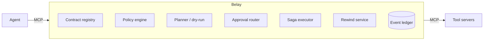

# Architecture

Stub for E0. The full diagram and component walkthrough are written in E9
once the proxy, planner, policy engine, approvals, executor, and rewind
service all exist end to end.

Planned shape (spec §3):

See `docs/spec.md` §3 for the normative request lifecycle.
