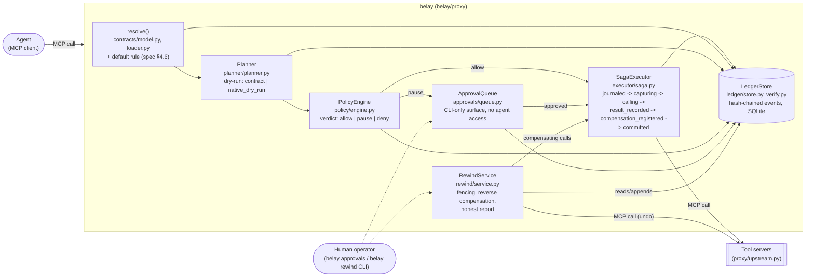

# Architecture

Belay sits as an MCP proxy between an agent and its tool servers: it speaks
MCP to the agent (server role) and MCP to the wrapped tools (client role,
spec Appendix C). Every tool call the agent makes is governed by the
lifecycle in `belay/proxy/lifecycle.py` before (and if necessary instead of)
reaching the real tool.

## Component map

## Request lifecycle (spec §3)

`belay/proxy/lifecycle.py` implements the normative sequence for every
governed call, in order, each stage appending its own ledger event(s)
(spec §9.1):

1. **resolve** — look up the tool's contract in the `ContractSet` fixed for
   the session (`session_started` pins `set_hash`). No contract + no
   `readOnlyHint` => `contract_missing`, unless `unsafe_passthrough` is
   explicitly configured for that tool (recorded as a `config_override` on
   every affected event).
2. **plan** (`Planner.plan`) — builds a `Plan` with effect estimates, in
   priority order `native_dry_run > dry_run > contract`. Plans expire
   (spec §5.4); re-invoking with different args invalidates a bound
   approval.
3. **policy** (`PolicyEngine.evaluate`) — evaluates blast-radius caps and
   defaults (irreversible/unknown effects pause by default, spec §6.4) and
   returns the most restrictive verdict across dimensions: `deny > pause >
   allow`.
4. **approval** (conditional) — a `pause` verdict parks the plan in
   `ApprovalQueue` and returns a structured `pending_approval` result to the
   agent instead of executing. The agent has no path to approve its own
   action (spec §7, no-self-approval); only the CLI (`belay approvals
   list|approve|reject`) can resolve an item.
5. **execute** (`SagaExecutor.run_step`) — the ordered step cycle: journal
   the step, run its (read-only) `capture`, call the real tool, record the
   result, materialize the `undo` args from what was captured
   (`compensation_registered` — rewind never re-evaluates expressions),
   commit. A crash between any two stages is recoverable from the ledger
   alone (`executor/recovery.py`); idempotency keys prevent double-calling
   the upstream tool on retry.
6. **ledger** — every stage above is a hash-chained, append-only event
   (`ledger/store.py`); `belay verify` recomputes the chain and cross-checks
   per-step coherence (journal/capture/result/compensation) without calling
   any tool (`ledger/verify.py`, `replay.py`).

## Rewind (spec §10)

`RewindService.rewind()` is a separate entry point (`belay rewind`, its own
CLI/process) that: fences the session first (a `session_fenced` ledger event
— fencing is a ledger fact, not in-memory state, because `belay run` and
`belay rewind` are different processes sharing only the SQLite file);
compensates committed steps in strict reverse `step_seq` order, each
compensation itself a mini-step through the same `PolicyEngine` (an
over-cap undo can pause, spec §12); runs any declared `verification`; and
reports `fully_rewound` only when every in-scope step is reversible *and*
ended up `compensated` — never when irreversible/conditional-unmet/
indeterminate steps are in scope, and never on a `--dry-run` (spec §10.3,
honesty).

## Conformance

`conformance/` (package `belay-conformance`) extracts every
`@conformance(level=...)` test into a target-agnostic suite driven by a
6-method `ConformanceTarget` adapter, so any MCP proxy — not just Belay —
can claim an L1/L2/L3 badge against the same tests. See `docs/spec.md` §13.
